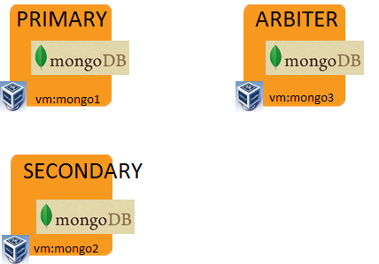

# Playbook_mongodb

## Description
mongodb構築(シャーディング構成なし)のplaybookです

## Overview



## Package
| Package         | Version  | Description |
| --------------- | -------- | ----------- |
| MongoDB        | 3.6.0    | 全Mongo VMにinstall |


## Installation

```
# export http_proxy=<your proxy settings>
# export https_proxy=<your proxy settings>

# vagrant up
# vagrant ssh master

$ sudo su -
# cd /vagrant
# bash play.sh
```

以上
